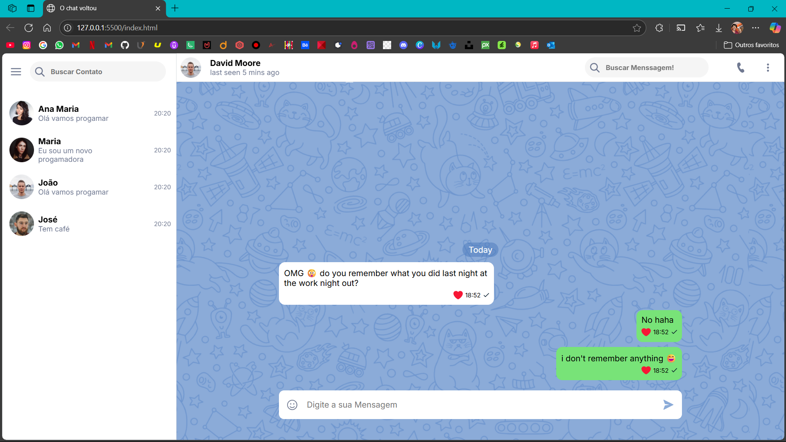

# Interface de Chat Web

Este projeto é uma interface de chat web responsiva e interativa construída com HTML, CSS e JavaScript. com tecnica e ensinamentos da plataforma de ensino O Novo Progamador.

## 🔍 Visão geral

A interface simula um ambiente de mensagens com:
- Listagem de contatos
- Histórico de conversas
- Envio de mensagens
- Emojis interativos
- Design responsivo

## 🛠️ Tecnologias utilizadas

- HTML5
- CSS3 (com um mini UI Kit personalizado)
- JavaScript puro

## 💻 Estrutura dos arquivos

📁 src/
├── 📁 assets/    # Recursos como imagens, áudio e ícones
│   ├── 📁 audio/
│   ├── 📁 css/
│   ├── 📁 fonts/
│   ├── 📁 icons/
│   ├── 📁 images/
├── 📁 js/        # Scripts JavaScript
│   ├── script.js
├── index.html
├── README.md
├── LICENSE


## 📸 Capturas de Tela

*Você pode adicionar aqui prints da interface se desejar.*



## 🚀 Como executar

Clone o repositório:
   ```bash
   git clone https://github.com/CleitonLealbb/chat-fake.git

 ## 📝 Licença Este projeto foi desenvolvido por **Cleiton Leal De Brito Batista** e está licenciado sob a Licença [CC BY-NC-ND 4.0](https://creativecommons.org/licenses/by-nc-nd/4.0/deed.pt-br). Você pode usar e compartilhar este conteúdo com atribuição, mas **não pode modificá-lo ou usá-lo comercialmente**.
